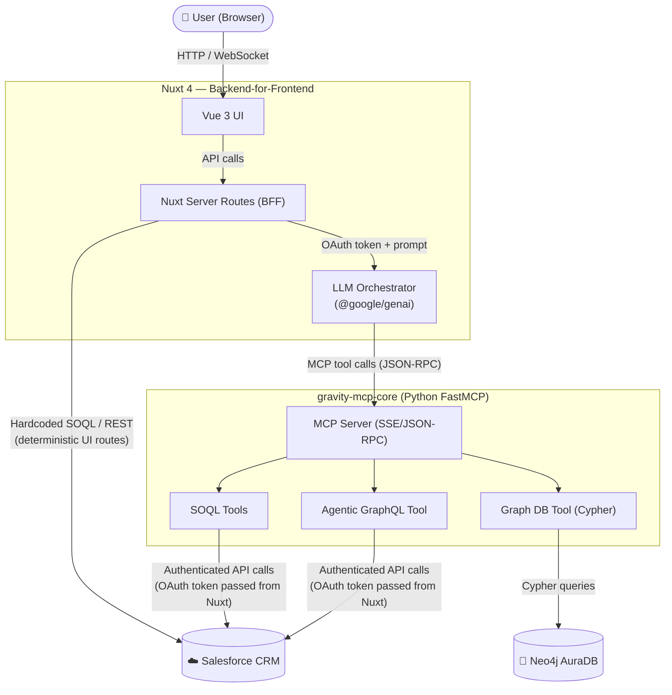

# Gravity Agent — Architecture Overview

This document provides a high-level overview of the architectural decisions, integration patterns, and authentication flows used in the Gravity Agent project.

Gravity is fundamentally an **integration architecture**: it acts as a translation and orchestration layer between a modern web UI, a Google Gemini AI agent, and the Salesforce CRM platform. The BFF and MCP server are the two pivotal integration points.

## 1. Tech Stack Overview

| Layer | Technology | Role |
|---|---|---|
| Frontend & BFF | Nuxt 4 (Vue 3, TypeScript, Nitro) | UI rendering, OAuth handling, LLM orchestration |
| AI Integration | Google Gemini SDK (`@google/genai`) | Reasoning, tool-calling, response generation |
| Agent Tooling | FastMCP (Python, JSON-RPC/SSE) | Exposes Salesforce and Graph DB tools to the LLM via MCP |
| Graph Database | Neo4j AuraDB (Cypher) | Relationship traversal, multi-hop reasoning over Salesforce entities |
| CRM System | Salesforce | Source of truth for all business data |
| Deployment | Render (free tier) | Hosts Nuxt and Python as separate Web Services from the same monorepo |

## 2. Architecture & Integration

### 2.1 Data Flow Diagram

### 2.2 Responsibility Boundaries

| Concern | Owner | Why |
|---|---|---|
| UI rendering & routing | Nuxt / Vue 3 | Server-side rendering, type safety |
| Salesforce OAuth handshake | Nuxt BFF | Keeps secrets server-side; avoids CORS |
| LLM orchestration & tool dispatch | Nuxt BFF (LLM Orchestrator) | Single place to manage model, system prompt, chat history |
| Dynamic / exploratory data access | FastMCP (Python) | Agentic GraphQL + SOQL; AI decides what to query |
| Relationship & multi-hop reasoning | FastMCP → Neo4j AuraDB | Graph traversal over Salesforce entity relationships (Accounts ↔ Opportunities) |
| Deterministic UI data access | Nuxt BFF (hardcoded routes) | Predictable latency; no LLM involved |
| Salesforce schema discovery | FastMCP `find_object_api_name` (SOQL-based) | Avoids heavy schema introspection; purpose-built |

### 2.3 Authentication Flow

1. User hits `/auth/login` → Nuxt BFF redirects to Salesforce OAuth 2.0 login.
2. Salesforce returns an `access_token` to the BFF callback route.
3. The token is stored in the Nuxt server session (encrypted).
4. On every agentic request, the BFF passes the token to the Python MCP server via request headers, so Salesforce enforces that user's Field-Level Security (FLS) natively.

### 2.4 Data Fetching Strategy

| Mode | Mechanism | Used For |
|---|---|---|
| Agentic GraphQL | LLM → MCP → Salesforce GraphQL API | Dynamic, AI-driven exploration |
| SOQL (via MCP) | LLM → MCP → Salesforce SOQL | Aggregate queries, structured searches, schema discovery |
| Graph DB (Cypher) | LLM → MCP → Neo4j AuraDB | Relationship traversal, multi-hop reasoning (e.g., "which accounts have the most opportunities?") |
| Hardcoded BFF Routes | Nuxt Server Route → Salesforce REST | Fixed UI dashboards, forms |

### 2.5 Neo4j Security Model

#### Structural Index Principle

Neo4j stores **structural (non-FLS-gated) properties** alongside Salesforce Record IDs and relationship edges. Financial, PII, and permission-sensitive data are **not** persisted; they are hydrated Just-In-Time (JIT) from Salesforce using the user's OAuth token, ensuring Salesforce's native Field-Level Security (FLS) and Object-Level Security (OLS) are enforced at query time.

This means Neo4j is a **structural reasoning layer**, not a data replica.

#### Property Classification

| Property | Stored in Neo4j | Why |
|---|---|---|
| `Account.Id` | ✅ Yes | Graph traversal anchor |
| `Account.Name` | ✅ Yes | Low-sensitivity structural classifier |
| `Account.Industry` | ✅ Yes | Classification metadata; not FLS-gated |
| `Account.BillingCountry` | ✅ Yes | Structural; not PII |
| `Account.Type` | ✅ Yes | Categorical label |
| `Account.AnnualRevenue` | ❌ No — JIT from SF | Financial; may be FLS-gated |
| `Opportunity.Id` | ✅ Yes | Graph traversal anchor |
| `Opportunity.Name` | ✅ Yes | Structural label |
| `Opportunity.StageName` | ✅ Yes | Pipeline stage; universally visible in CRM |
| `Opportunity.CloseDate` | ✅ Yes | Temporal classifier; not a financial figure |
| `Opportunity.Type` | ✅ Yes | Categorical (New Business, Renewal, etc.) |
| `Opportunity.Amount` | ❌ No — JIT from SF | Financial; FLS-sensitive |
| `User.Id` | ✅ Yes | Graph traversal anchor for ownership edges |
| `User.Name` | ✅ Yes | Business identity; not PII in B2B CRM context |
| `User.Title` | ✅ Yes | Role/seniority; structural |
| `User.Email` | ❌ No — JIT from SF | PII |
| Any Contact PII (Email, Phone) | ❌ No — JIT from SF | PII; sharing-model dependent |
| Custom permission-gated fields | ❌ No — JIT from SF | Variable FLS per Salesforce org |

#### Edge Sensitivity Classification

| Edge Type | Sensitivity | Notes |
|---|---|---|
| `(Account)-[:HAS_OPPORTUNITY]->(Opportunity)` | Low | Standard CRM relationship. Existence of the edge is not sensitive. |
| `(User)-[:OWNS]->(Account)` | Low | Record ownership is visible to all internal users in a standard CRM org. |
| `(User)-[:OWNS]->(Opportunity)` | Low | Same as above; OwnerId is not a restricted field. |

> [!IMPORTANT]
> Any new node type or edge type added to the graph **MUST** be reviewed against this classification. If the existence of a relationship is itself sensitive (e.g., Patient → Diagnosis), additional edge-filtering logic is required in the HydrationService.

#### Sync Strategy

The current sync mechanism is an on-demand MCP tool (`sync_salesforce_to_neo4j`) that performs a full Salesforce-to-Neo4j sync of IDs and edges. For production, this should be replaced with Salesforce Change Data Capture (CDC) for near-real-time incremental updates.

## 3. Tradeoffs Accepted

| Decision | Alternative Considered | Why We Accepted This |
|---|---|---|
| **Salesforce User OAuth (Per-User Delegation)** | Service Account / Integration User | OAuth ensures Salesforce automatically enforces Field-Level Security (FLS) per user. Traded the simplicity of a Service Account for robust, native Salesforce security. |
| **Agentic GraphQL via MCP** | Hardcoded REST Endpoints for all data access | Accepted the risk of malformed AI queries (hallucinations) to gain extreme flexibility. The agent can explore custom Salesforce instances dynamically without requiring new backend endpoints. |
| **Keeping Hardcoded BFF Routes for UI** | Full transition to Agentic GraphQL for everything | Retained hardcoded BFF routes (e.g., `opportunities.get.ts`) and `SalesforceService.ts` to power deterministic UI dashboards and forms, avoiding the latency and unreliability of an LLM formulating queries for standard views. |
| **Custom MCP Introspection Tool** | Full GraphQL Schema Introspection | Retained the custom `find_object_api_name` MCP tool because standard Salesforce GraphQL schema introspection is massively heavy and costly. This optimization prevents performance bottlenecks for the LLM. |
| **Neo4j AuraDB for Graph Queries** | Querying relationships via Salesforce SOQL JOINs or multiple API calls | Accepted the operational overhead of a separate Graph DB to gain native multi-hop traversal and relationship reasoning. SOQL is limited to 5-level parent-child relationships and cannot perform graph-style pathfinding. Neo4j enables the agent to reason about entity networks (e.g., account portfolios, opportunity clustering) that would be impractical via API calls alone. |
| **Index-Only Neo4j with JIT Salesforce Hydration** | Syncing all properties and replicating Salesforce permissions in Neo4j | Replicating Salesforce's dynamic sharing model externally is an anti-pattern. Accepted the two-step query cost (Neo4j traversal → Salesforce hydration) to guarantee 100% fidelity with native FLS/OLS, ensuring zero data leakage. **Evolved to "Structural Index":** Non-FLS-gated structural fields (Name, Industry, StageName, CloseDate, Type) are now stored in Neo4j to enable graph-native filtering. Financial and PII fields remain JIT-hydrated. |
| **BFF Pattern** | Direct frontend-to-Salesforce API calls | Traded slightly more backend routing code for enhanced security (hiding API keys) and avoiding complex browser CORS issues. |
| **Two separate services (Nuxt + Python)** | Monorepo with a single Node process | Keeps language runtimes isolated; each service can be scaled, deployed, and restarted independently on Render. |
| **Public Web Service for MCP Backend** | Render Private Service (Internal Network) | Private Services are paid; unnecessary for a portfolio project. The exposure is already mitigated by architecture: Salesforce tools require a valid OAuth token passed per-request from the BFF (no token = no data), and Neo4j stores only Record IDs and edges (Index-Only Principle), so even direct access yields no business data. The real security boundary is the OAuth token, not network isolation. |

## 4. Non-Functional Characteristics

| Characteristic | Current Approach | Known Limitation |
|---|---|---|
| **Latency** | Hardcoded routes are fast (<200ms). Agentic paths add LLM round-trip overhead (1–5s typical). | Agentic responses are not suitable for real-time UI interactions. |
| **Scalability** | Stateless Nuxt BFF; Python MCP is stateless per-request. | Salesforce API governor limits apply; no request queuing implemented. |
| **Reliability** | Gemini API key fallback (`GEMINI_API_KEY2`). | No retry logic on MCP tool failures; single-region deployment. |
